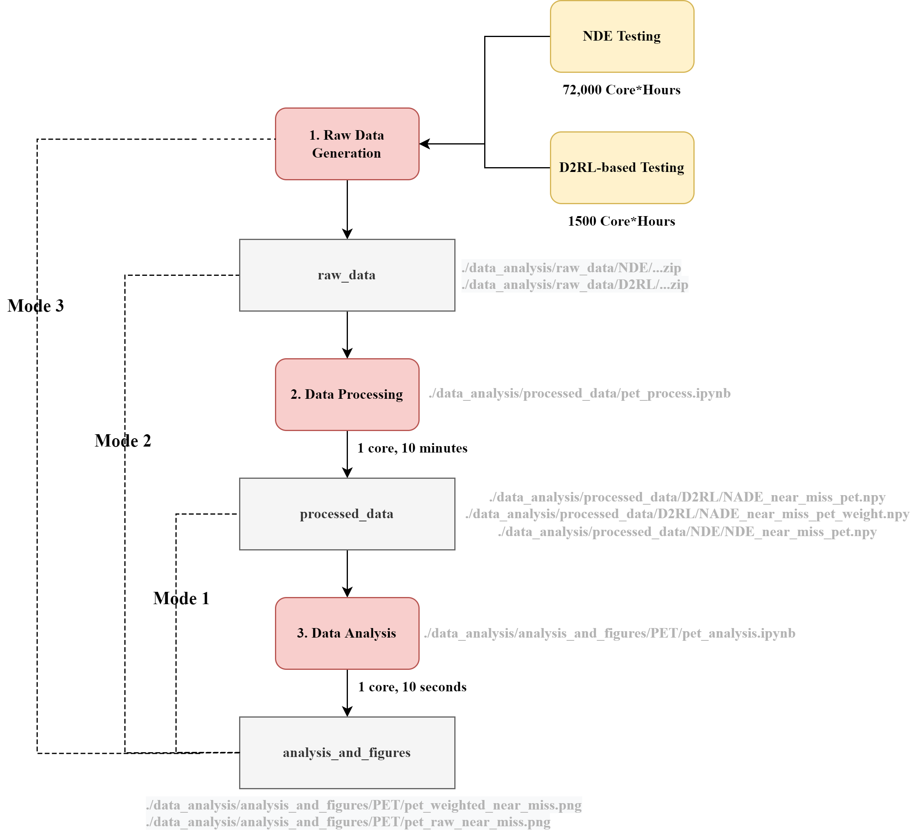
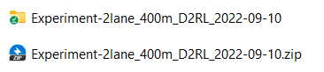

# AI against AI: Dense deep reinforcement learning for safety validation of autonomous vehicles

<!-- ABOUT THE PROJECT -->
# About the Project

This project contains the source code and data for "AI against AI: Dense deep reinforcement learning for safety validation of autonomous vehicles".

# Installation
1. Python installation
   
This repository is developed and tested under python 3.10.4 on Ubuntu 20.04 system.


2. Create new virtual environment (Optional)
   
Virtual environment is recommended to be utilized to run this repo, as it can provide high flexibility. To install the virtual environment, please use the following commands:
```bash
virtualenv venv
source venv/bin/activate
```

3. Install all required packages

This repository is built based on several python packages, which can be installed using the following command:
```bash
pip install -r requirements.txt
```

<!-- USAGE EXAMPLES -->

# Usage

All the data, code and results are stored in `/data_analysis` folder. In the paper, several safety-critical variables are analysed, including time-to-collision, post-enroachment-time, bumper-to-bumper distance, crash rate, crash type, and crash severity. In this section, we will use the post-enroachment-time (PET) analysis as an example, while all other indexes follow the same procedure. Each functionality is stored in a seperate jupyter notebook.

Briefly speaking, the data analysis can be divided into three steps:
1. Raw experiment result generation
2. Data processing
3. Data analysis
   
For each step, the intermediate data is generated and will be utilized in the next step. For the convenience of usage, we have also generated all the intermediate data, which are stored in `/data_analysis`. Therefore, users can start from any step and generate the final results. For example, you can only run the step 3 (data analysis), or you can only run step 2 and step 3, as the step 1 (raw data generation) can be very time-consuming. Specifically, there are three running modes as follows:

* Mode 1, data analysis using existing experiment results;
* Mode 2, data process and data analysis using existing experiment results;
* Mode 3, raw experiment result generation, data process, and data analysis.

 To provide further details of the three code running modes, a flowchart of PET data generation, processing, and analysis is provided as follows:

 

## 1. Raw Data Generation

To get the raw experiment results, two options are provided

* Option 1 (recommended): Use existing experiment results
  * Please note that all experiments are zipped to reduce the storage space. To utilize the experiment results and analyse the data, please first unzip all zipped files to the same directory. Please note that the unzip process could take about 90 minutes and the total size of the unzipped files is around 120 GB. 
    * For D2RL experiment results, the zipped file and unzipped folders should follow the file structure as shown in the following figure:
  
    * For NDE experiment results, the zipped file and unzipped folders should follow the file structure as shown in the following figure: 
  * D2RL experiment results are stored in `/data_analysis/raw_data/D2RL`
    * "Experiment-2lane_400m_D2RL_2022-09-10"
  * NDE experiment results are stored in `/data_analysis/raw_data/NDE`
    * "Experiment-2lane_400m_NDE_v1_2022-09-09"
    * "Experiment-2lane_400m_NDE_v2_2022-09-09"
    * "Experiment-2lane_400m_NDE_v3_2022-09-09"
* Option 2 (time-consuming): Run the experiments to generate the raw experiment data
  * For NDE experiments: 72,000 core*hours are needed
  * For D2RL experiments: 1,500 core*hours are needed
    * > 1 core*hour denotes the simulation running on one cpu core (Intel Xeon Gold 6154 3.0GHz) for one hour
  * Please run the following commands to run the simulation and generate the experiment results from Naturalistic Driving Environment (NDE) or D2RL-based testing environment:
    * ```python
      python main.py --experiment_name 2lane_400m_NDE_testing --mode NDE # Use this for NDE Testing
    * ```python 
      python main.py --experiment_name 2lane_400m_D2RL_testing --mode D2RL # Use this for D2RL Testing
    * By default, the simulation result will be stored in `./data_analysis/raw_data/experiment_name`.

## 2. Data Processing

The raw data generated by the experiments will contain all informations including the speed, position, acceleration, and steering angle of all vehicles in the experiments. To calculate the metrics of interest such as PET, the raw data needs to be processed. 

The processing code is stored in `/data_analysis/processed_data/`. For example, the processing code of the PET for both NDE experiments and D2RL experiments can be found in the jupyter notebook `pet_process.ipynb`, including several major procedures:

* Load raw experiment results
* Data processing: transfer raw information (e.g., speed and position) to indexes (e.g., PET)
* Store the processed data into `/data_analysis/processed_data/NDE` or `/data_analysis/processed_data/D2RL`
* After the data processing, you should be able to find newly generated files:
  * `NADE_near_miss_pet_weight.npy` and `NADE_near_miss_pet.npy` under `/data_analysis/processed_data/D2RL`
  * `NDE_near_miss_pet.npy` under `/data_analysis/processed_data/NDE`

> If you want to process the newly generated experiment results, you should modify the following codes in the jupyter notebook
```python
root_folder = "../raw_simulation_results/D2RL/" # Please change it as the position where you stored the newly generated raw experiment data
path_list = ["Experiment-2lane_400m_IDM_NADE_2022-09-01"] # Please change it as the name of the folder generated in your new experiments
```


## 3. Data Analysis
All the data analysis codes and generated figures can be found in `/data_analysis/analysis_and_figures/`. The file structure is as shown in follows:
```
data_analysis/
|__ raw_data
|__ processed_data
|___analysis_and_figures
|______ crash_analysis
|_________ crash_severity_type_plot.ipynb
|______ crash_rate
|_________ crash_rate_bootstrap_plot.ipynb
|______ near_miss_TTC_distance
|_________ ttc_distance_analysis_json.ipynb
|______ PET
|_________ pet_analysis.ipynb
```
For example, the PET data analysis code can be found in `/data_analysis/analysis_and_figures/PET/pet_analysis.ipynb`, including the following major procedures:

* Load the processed experiment data from `/data_analysis/processed_data`
* Plot the PET histgram of D2RL experiments and NDE experiments, and then save the figures to `/data_analysis/analysis_and_figures/PET`.