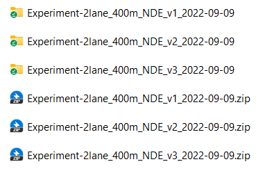

# Dense reinforcement learning for safety validation of autonomous vehicles

<!-- ABOUT THE PROJECT -->
# About the Project

This project contains the source code and data for "Dense reinforcement learning for safety validation of autonomous vehicles". H. L. and the team have filed a US provisional patent application 63/338,424.

The code structure is as follows:

```
Dense-Deep-Reinforcement-Learning/
|__ conf
|__ maps
|__ checkpoints
|__ source_data
|__ mtlsp
|__ envs
|__ controller
|__ data_analysis
|______ raw_data 
|______ processed_data 
|______ analysis_and_figures 
|__ main.py
|__ utils.py
|__ nadeinfoextractor.py
|__ requirements.txt
```

# Installation
1. Python installation
   
This repository is developed and tested under python 3.10.4 on Ubuntu 20.04 system.


2. Create a new virtual environment (Optional)
   
A virtual environment is recommended to be utilized to run this repo, as it can provide high flexibility. To install the virtual environment, please use the following commands:
```bash
virtualenv venv
source venv/bin/activate
```

3. Install all required packages

This repository is built based on several python packages, which can be installed using the following command:
```bash
pip install -r requirements.txt
```

4. Download all required datasets

Due to the size limit of the github, the raw data and some processed data cannot be uploaded. Therefore, we store the `data_analysis` folder in the Google Drive. The user should download the `data_analysis` folder from [Google Drive](https://drive.google.com/file/d/1OFIEcHuBLiDbpgDmQAK0olMAAUsEsPkX/view?usp=share_link). Then, the user should merge the downloaded `data_analysis` folder with the original `data_analysis` folder in the repo.

5. Install ipykernel (for Jupyter notebook)

Before running jupyter notebooks in the data analysis, the ipykernel is needed. To install it, users can run the following command:
```bash
pip install ipykernel
```
<!-- USAGE EXAMPLES -->

# Usage

All the data, code, and results are stored in `/data_analysis` folder. In this project, several performance metrics are analyzed, including time-to-collision, post-encroachment-time, bumper-to-bumper distance, crash rate, crash type, and crash severity. In this section, we will use the post-encroachment-time (PET) analysis as an example, while all other performance metrics follow the same procedure. The code for each performance metric analysis is stored in a separate jupyter notebook.

> For jupyter notebook usage, please refer to https://docs.jupyter.org/en/latest/

For the convenience of usage, we provide three running modes as illustrated in the following figure. Specifically, there exist three steps to reproduce the experiment results:

* **1. Raw data generation**
* **2. Data processing**
* **3. Data analysis**

As the raw data generation is time-consuming (e.g., 72,000 core*hours are needed for the NDE testing experiment), we also provide the data generated in our experiments, so users can use the data to skip the first two steps (Mode 1) or the first step (Mode 2) for quick reproduction. Specifically, there are three running modes as follows:

* **Mode 1 (recommended)**: data analysis (step 3) using the data generated in our experiments;
* **Mode 2**: data processing (step 2) and data analysis (step 3) using the data generated in our experiments;
* **Mode 3**: raw data generation (step 1), data processing (step 2), and data analysis (step 3).

> 1 core*hour denotes the simulation running on one CPU core (Intel Xeon Gold 6154 3.0GHz) for one hour. 

To provide further details of the three code running modes, a flowchart of PET data generation, processing, and analysis is provided as follows:

 

## 1. Raw Data Generation


* **For Mode 1:** this step is skipped.
* **For Mode 2:** this step is skipped
* **For Mode 3:**
  * Please run the following commands to run the simulation and generate the raw experiment results for Naturalistic Driving Environment (NDE) testing and D2RL-based testing:
    * ```python
      python main.py --experiment_name 2lane_400m_NDE_testing --mode NDE # Use this for NDE Testing
    * ```python 
      python main.py --experiment_name 2lane_400m_D2RL_testing --mode D2RL # Use this for D2RL Testing
    * By default, the simulation result will be stored in `./data_analysis/raw_data/experiment_name`.

## 2. Data Processing

* **For Mode 1:** this step is skipped.
* **For Mode 2:** 
  * Before running mode 2, the dataset under `/data_analysis/raw_data` needs to be unzipped first. All zipped files should be unzipped to the same directory. Please note that the unzip process could take about 30 minutes and the total size of the unzipped files is around 130 GB.
    * For D2RL experiment results, the zipped file and unzipped folders should follow the file structure as shown in the following figure:
  
    * For NDE experiment results, the zipped file and unzipped folders should follow the file structure as shown in the following figure: 
  * Run all the code cells in the jupyter notebook (click "Run all" button in the menu bar of the notebook)
  * The processing code is stored in `/data_analysis/processed_data/`. For example, the processing code of the PET for both NDE experiments and D2RL experiments can be found in the jupyter notebook `pet_process.ipynb`, including several major procedures:
      * Load raw experiment results
      * Data processing: transfer raw information (e.g., speed and position) to performance metrics (e.g., PET)
      * Store the processed data into `/data_analysis/processed_data/NDE` or `/data_analysis/processed_data/D2RL`
      * After the data processing, you should be able to find newly generated files:
        * `NADE_near_miss_pet_weight.npy` and `NADE_near_miss_pet.npy` under `/data_analysis/processed_data/D2RL`
        * `NDE_near_miss_pet.npy` under `/data_analysis/processed_data/NDE`

* **For Mode 3:**
  * Please modify the following codes in the jupyter notebook to process the newly generated experiment results:
  * ```python
    root_folder = "../raw_simulation_results/D2RL/" # Please change it to the position where you stored the newly generated raw experiment data
    path_list = ["Experiment-2lane_400m_IDM_NADE_2022-09-01"] # Please change it as the name of the folder generated in your new experiments
    ```
  * After the modification, users can follow the data processing for Mode 2.


## 3. Data Analysis

> This step is the same for all three running modes.

All the data analysis codes and generated figures can be found in `/data_analysis/analysis_and_figures/`. The file structure is as shown in follows:
```
data_analysis/
|__ raw_data
|__ processed_data
|___analysis_and_figures
|______ crash_analysis
|_________ crash_severity_type_plot.ipynb # Analyze the crash severity and the crash type
|______ crash_rate
|_________ crash_rate_bootstrap_plot.ipynb # Analyze the crash rate, the convergency number
|______ near_miss_TTC_distance
|_________ ttc_distance_analysis_json.ipynb # Analyze the TTC, bumper-to-bumper distance
|______ PET
|_________ pet_analysis.ipynb # Analyze the PET
```
For example, the PET data analysis code can be found in `/data_analysis/analysis_and_figures/PET/pet_analysis.ipynb`, including the following major procedures:

* Load the processed experiment data from `/data_analysis/processed_data`
* Plot the PET histogram of D2RL experiments and NDE experiments, and then save the figures to `/data_analysis/analysis_and_figures/PET`.


# Contributing

Contributions are what make the open source community such an amazing place to be learn, inspire, and create. Any contributions you make are **greatly appreciated**.

1. Fork the Project
2. Create your Feature Branch (`git checkout -b feature/AmazingFeature`)
3. Commit your Changes (`git commit -m 'Add some AmazingFeature'`)
4. Push to the Branch (`git push origin feature/AmazingFeature`)
5. Open a Pull Request

# Developers

Haowei Sun (haoweis@umich.edu)

Haojie Zhu (zhuhj@umich.edu)

Shuo Feng (fshuo@umich.edu)

For help or issues using the code, please create an issue for this repository or contact Haowei Sun (haoweis@umich.edu).
# Contact

For general questions about the paper, please contact Henry Liu (henryliu@umich.edu).